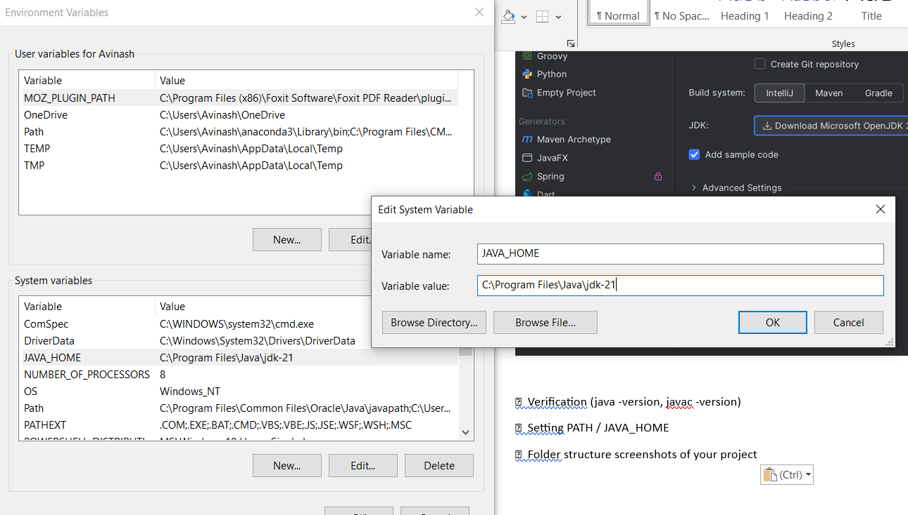
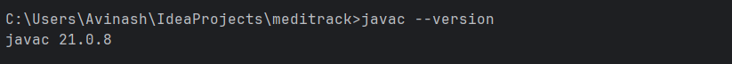
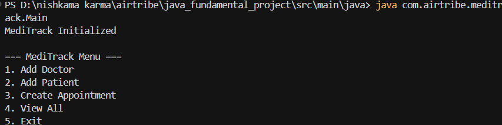
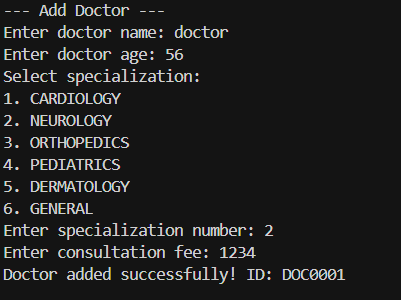
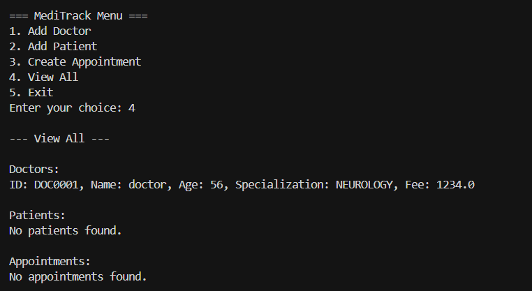
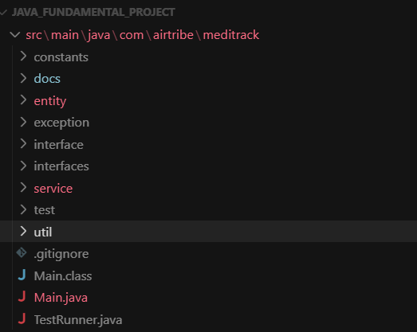

# Setup Instructions for MediTrack

## JDK Installation

### Step 1: Download JDK
1. Visit the official Oracle website (https://www.oracle.com/java/technologies/downloads/) or OpenJDK (https://adoptium.net/)
2. Download JDK 11 or higher (JDK 17 recommended for best compatibility)
3. Choose the appropriate version for your operating system (Windows, macOS, or Linux)


*Figure 1: JDK Download Page*

### Step 2: Install JDK on Windows
1. Run the downloaded installer (.exe file)
2. Follow the installation wizard
3. Accept the license agreement
4. Choose installation directory (default: `C:\Program Files\Java\jdk-<version>`)
5. Complete the installation


*Figure 2: JDK Installation Wizard*

### Step 3: Set Environment Variables (Windows)
1. Right-click "This PC" → Properties → Advanced System Settings
2. Click "Environment Variables"
3. Under "System Variables", find or create `JAVA_HOME`:
   - Variable name: `JAVA_HOME`
   - Variable value: `C:\Program Files\Java\jdk-<version>` (your JDK installation path)
4. Edit the `Path` variable and add: `%JAVA_HOME%\bin`
5. Click OK to save all changes


*Figure 3: Setting JAVA_HOME Environment Variable*


*Figure 4: Adding Java to PATH Variable*

### Step 4: Verify Installation
Open Command Prompt or PowerShell and run:
```bash
java -version
javac -version
```
You should see the Java version information if installation is successful.



*Figure 5: Verifying Java Installation*

## How to Run Main

### Prerequisites
- JDK 11 or higher installed and configured
- Command line access (Command Prompt, PowerShell, or Terminal)

### Step 1: Navigate to Project Directory
Open your terminal/command prompt and navigate to the project root directory:
```bash
cd "c:/java_fundamental_project"
```

### Step 2: Compile Java Files
Compile all Java source files:
```bash
javac -d target/classes -sourcepath src/main/java src/main/java/com/airtribe/meditrack/**/*.java
```

Or compile from the source directory:
```bash
cd src/main/java
javac com/airtribe/meditrack/Main.java
```


*Figure 6: Compiling Java Source Files*

### Step 3: Run the Application
Run the Main class:
```bash
java -cp target/classes com.airtribe.meditrack.Main
```

Or if compiled in the source directory:
```bash
java -cp . com.airtribe.meditrack.Main
```

### Step 4: Using the Application
Once the application starts, you will see the MediTrack menu:
- Enter `1` to Add Doctor
- Enter `2` to Add Patient
- Enter `3` to Create Appointment
- Enter `4` to View All records
- Enter `5` to Exit


*Figure 7: MediTrack Application Main Menu*


*Figure 8: Adding a Doctor Example*


*Figure 9: Viewing All Records*

### Troubleshooting
- **"javac is not recognized"**: Ensure JDK is installed and PATH is configured correctly
- **"ClassNotFoundException"**: Check that you're running from the correct directory with proper classpath
- **Compilation errors**: Ensure all source files are present and package structure is correct

Folder structure screenshots of your project


*Figure 10: View folder structure*


